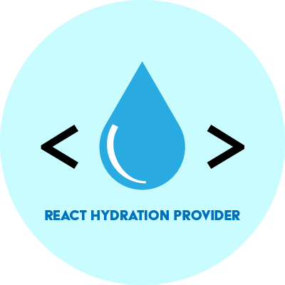

<p align="center">
  
</p>

> `react-hydration-provider` makes it easy to control what your app renders before and after app hydration.
>
> This makes it simple to avoid hydration errors and other problems related to Server-side Rendering (SSR), Static Site Generation (SSG), Deferred Static Generation (DSG), etc.

- [Learn about the problems this solves.](#problem-explanation)
- [View Examples](#examples)
- [Read the API reference](#api)
- <a href="https://traviswimer.com/blog/easily-fix-react-hydration-errors" target="_blank" title="Easily Fix React Hydration Errors">Blog post about React hydration issues</a>

## Getting Started

### Install

**Yarn:**

```shell
yarn add react-hydration-provider
```

**NPM:**

```shell
npm install react-hydration-provider
```

### importing the package

**ES import**

```javascript
import {
	HydrationContext,
	HydrationProvider,
	useHydrated,
	Server,
	Client,
	createHydration,
	useComponentHydrated,
} from "react-hydration-provider";
```

**CommonJS require()**

```javascript
const {
	HydrationContext,
	HydrationProvider,
	useHydrated,
	Server,
	Client,
	createHydration,
	useComponentHydrated,
} = require("react-hydration-provider");
```

### Usage with Server Components

_Requires `react-hydration-provider` version 2.1.0 or later_

If you are using [React Server Components](https://react.dev/blog/2023/03/22/react-labs-what-we-have-been-working-on-march-2023#react-server-components), you should be able to use `HydrationProvider` and it's corresponding hooks/components without any changes.

If you are using the standalone `useComponentHydrated` hook, you will need to include the [`"use client";`](https://react.dev/reference/react/use-client) directive in any component that uses it.

<h3 id="examples">Usage examples</h3>

**Basic Example**

```javascript
import { HydrationProvider, Server, Client } from "react-hydration-provider";

function App() {
	return (
		// HydrationProvider should usually be placed at a high level in your app.
		<HydrationProvider>
			<main>
				<Server>
					<p>
						This will be rendered during html generation (SSR, SSG, etc) and the
						initial app hydration. It should always have a reliable value that
						will render the same in both a server and client environment.
					</p>
				</Server>
				<Client>
					<p>This will be rendered after initial app hydration.</p>
					<p>
						It can safely contain dynamic content, like this: {Math.random()}
					</p>
				</Client>
				<p>This will always be rendered.</p>
			</main>
		</HydrationProvider>
	);
}
```

**Only render on client**

```javascript
import { HydrationProvider, Server, Client } from "react-hydration-provider";

function App() {
	return (
		<HydrationProvider>
			<main>
				<Client>
					<p>
						Nothing will be rendered to the user until the React app has
						initialized and hydrated.
					</p>
				</Client>
			</main>
		</HydrationProvider>
	);
}
```

**Manually checking hydration state**

```javascript
import { HydrationProvider, useHydrated } from "react-hydration-provider";

function MyComponent() {
	// useHydrated() is the same hook used by the <Client> and <Server> components.
	// If <Client> and <Server> don't meet your needs, this can be used instead.
	const hydrated = useHydrated();
	return hydrated ? <p>Client render</p> : <p>Server render</p>;
}

function App() {
	return (
		<HydrationProvider>
			<main>
				<MyComponent />
			</main>
		</HydrationProvider>
	);
}
```

**Skip the Provider**

`useComponentHydrated()` will cause a component to independently determine if the app is hydrated and may be less efficient.

Usually you will want to use `<HydrationProvider` along with `useHydrated()` or the `<Server>` and `<Client>` components. Using the provider allows the hydration check to only be performed once for your entire app.

[Read more about why you should use `useHydrated()` instead.](#hydration-rerenders-explanation)

```javascript
import { useComponentHydrated } from "react-hydration-provider";

function MyComponent() {
	const hydrated = useComponentHydrated();
	return hydrated ? <p>Client render</p> : <p>Server render</p>;
}

function App() {
	return (
		<main>
			<MyComponent />
		</main>
	);
}
```

<h2 id="api">API Reference</h2>

### `<HydrationProvider>`

A Context Provider that allows child components to determine if the app has been hydrated.

This should generally be used near the highest level of your app.

_The only prop accepted is `children`_

### `<Server>`

Component to wrap the content you want to render when HTML is generated on a server or your local machine (SSR, SSG, DSG, etc). This content will also be rendered during the first render of your app to ensure your app matches the HTML during hydration.

**IMPORTANT: Ensure child components of `<Server>` are always predictable. It should always render the same. If not, you may still see hydration errors.**

### `<Client>`

Component to wrap the content you want to render after your React app has hydrated. It should never be rendered on the server-side.

Inside this component child components do not need to be reliable. It can render differently every time and there will be no hydration issues.

### `useHydrated()`

**React hook function**

Returns `true` if app is hydrated. Returns `false` if it has not yet been hydrated.

### `HydrationContext`

The React `Context` used by `HydrationProvider`.

You probably don't need to use this, but it is available in case there is an edge-case that requires it.

### `useComponentHydrated()`

**React hook function**

You should usually use `useHydrated()` instead.

It works exactly the same as `useHydrated()`, except the component using it will independently perform the hydration check each time it is mounted. This may [lead to inefficiencies](#hydration-rerenders-explanation).

This hook can be used completely independently. It does not require the use of a `HydrationProvider`.

### `createHydration()`

**Factory function to allow the use of multiple providers**

This function returns the same API as documented here (with the exception of `useComponentHydrated()` and `createHydration`):

- HydrationContext
- HydrationProvider
- Server
- Client
- useHydrated()

This should only be necessary in complex scenarios where multiple Providers/Contexts are necessary.

_Example:_

```javascript
const { HydrationContext, HydrationProvider, useHydrated, Server, Client } =
	createHydration();
```

<h2 id="problem-explanation">What problems does this solve?</h2>

<h3 id="hydration-errors-explanation">Hydration Errors from client/server mismatch</h3>

Server-Side Rendering (SSR) and other pre-rendering methods require your client-side React app to use a process called "hydration" to seamlessly transition the HTML received from the server into an interactive Single-Page App (SPA).

For this to work correctly, the HTML from the server needs to **exactly** match what is generated by your React app or you will see errors/warnings:

- `Warning: Text content did not match. Server: "Pre-rendered server content" Client: "Client app content" at div.`
- `Warning: An error occurred during hydration. The server HTML was replaced with client content in div.`
- `Text content does not match server-rendered HTML.`
- `Hydration failed because the initial UI does not match what was rendered on the server.`
- `There was an error while hydrating. Because the error happened outside of a Suspense boundary, the entire root will switch to client rendering.`

This is generally a result of your React app using dynamic content. For example, you might be using dates formatted to the current user's locale or you might be retrieving data from `localStorage`.

In these cases, your app requires data that is only available on the user's machine. Obviously the server (or your local machine) has no way of knowing what this data will be.

`react-hydration-provider` solves this using the `<Server>` and `<Client>` components. Putting all your dynamic content (Dates, localStorage, etc.) inside a `<Client>` ensures that it is not included during "hydration". If you want some content to be displayed only before the app has hydrated, you simply put it inside a `<Server>`. It is still possible to encounter mismatch errors from the content inside a `<Server>`. Ensure that it is always static/predictable on both the client and server.

<h3 id="hydration-rerenders-explanation">Only one re-render</h3>

As the name implies, `react-hydration-provider` utilizes a React Context Provider (`HydrationProvider`) to store the hydration state of your React app.

The purpose of this is to only require the hydration check to run once at the highest level and then pass that down to `<Server>` and `<Client>` components.

The common way to check if an app is hydrated is to use `useEffect()` to delay certain code until after the first render. This is the technique used in `useComponentHydrated()`:

```javascript
export function useComponentHydrated() {
	// Once useEffect() has been called, we know the app has been hydrated.
	const [hydrated, setHydrated] = React.useState(false);
	React.useEffect(() => {
		setHydrated(true);
	}, []);

	return hydrated;
}
```

When you use this hook, it will trigger a re-render in the component that uses it when the value of `hydrated` changes.

Imagine you have a site with 2 pages, `page-a` and `page-b`. If a user directly navigates to the URL for `page-a`, your server will send them the HTML for `page-a`. Then your React app will hydrate and any components in `page-a` using `useComponentHydrated()` will re-render.

At this point everything is great, but now let's say the user clicks a link to navigate to `page-b`. Any components in `page-b` using `useComponentHydrated()` will render twice. This is completely unnecessary, as hydration mismatches are only a concern when the app first initializes.

By using a `<HydrationProvider>`, `<Server>`, and `<Client>`, `react-hydration-provider` is able to run this check only once when the React app first initializes, eliminating the need for components to constantly re-render.

Basically, anything inside a `<Server>` will never be rendered if the app has already hydrated.

### SEO with dynamic content

One of the benefits of pre-rendering your HTML is that it makes it easier for search engines to crawl your site, since it isn't dependent on your React app initializing.

As explained in the [previous section](#hydration-errors-explanation), dynamic content causes hydration errors. A common solution is to simply delay rendering this content until after hydration. That means the HTML file will not contain this content, eliminating the SEO benefits.

In these cases, you can use the `<Server>` component to specify static content that should be included in the HTML file, allowing search engines to see this content before your React app has initialized.

### Displaying placeholders before app initialization

The `<Server>` component makes it simple to include placeholders like loading-spinners to improve your site's UX before the React app has initialized.

## Project Links

- [NPM](https://www.npmjs.com/package/react-hydration-provider)
- [GitHub](https://github.com/traviswimer/react-hydration-provider)

## Author

#### Travis Wimer

- <a href="https://traviswimer.com/developer-portfolio" title="React Native, React, NodeJS, UI/UX Developer" target="_blank">Developer Portfolio</a>
- <a href="https://traviswimer.com/blog" title="React Native, React, NodeJS, UI/UX Blog" target="_blank">Blog</a>
- <a href="https://www.linkedin.com/in/traviswimer/" title="Developer Resume" target="_blank">LinkedIn</a>
- <a href="https://twitter.com/Travis_Wimer" title="Travis Wimer | Software Developer" target="_blank">Twitter</a>
- <a href="https://traviswimer.com/developer-portfolio/react-hydration-provider" title="react-hydration-provider | Travis Wimer" target="_blank">react-hydration-provider Portfolio Page</a>

## License

MIT. Copyright © 2022 Travis Wimer
